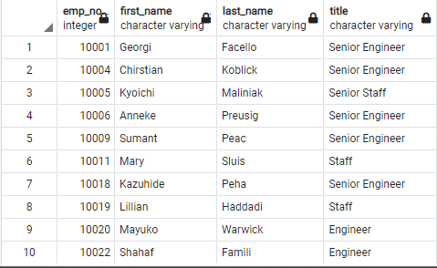
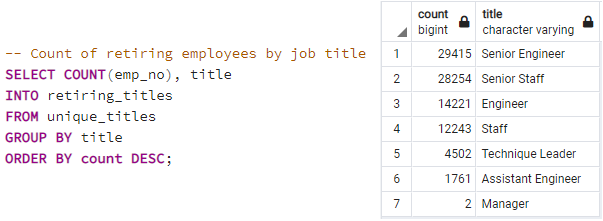
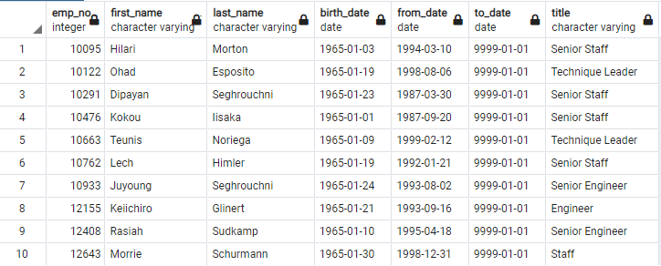
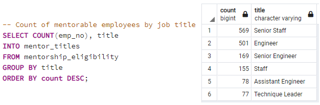
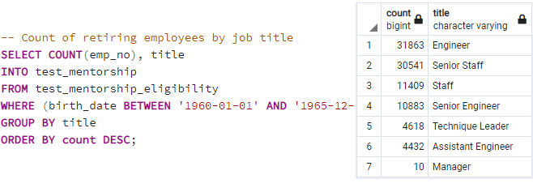

# Silver Tsunami Analysis

## Overview
---

Pewlett Hackard is a large company, having several hundred thousand employees. As Baby Boomers begin to retire, Pewlett Hackard is looking to the future in 2 ways. First, It's offering retirement packages for those who meet certain criteria and second, It's starting to think about which positions will need to be filled in the near future with the number of upcoming retirements creating thousands of openings. As an HR Analyst, I am tasked with identifying who within the company we can expect to be retiring within the coming years as well as a plan to fill the number of vacant positions we can expect to need to be filled.

## Results
---

-   I created a list of employees who are eligible to receive the retirement package. This was accomplished by sorting all of our current employees by the year they were born being 1952 through 1956. Below is a sample of the data collected.

    

-   Next, I identified the number of open positions needing to be filled per position of those who we expect to be retiring soon. The majority of the open positions will be for our Senior engineers and Senior Staff members. 

     

-   Finally, I created a list of employees who would be candidates for a mentorship program intended to up-skill the current workforce in an effort to get ahead of the large number of retirements. This list consisted of employees born in the year of 1965.

     

- I also broke out the list of mentorship candidates into their current position for review in comparison.

    

## Summary:
---

Ultimately, A total of 90,398 employees are eligible for the new retirement package and there are only 1,549 employees originally identified as eligible for the mentorship program. My recommendation would be to expand the range of eligible mentorship candidates to range from 1960 to 1965 which would provide a large enough pool of candidates to potentially fill the vacant roles until recruiting can bring in new talent.

